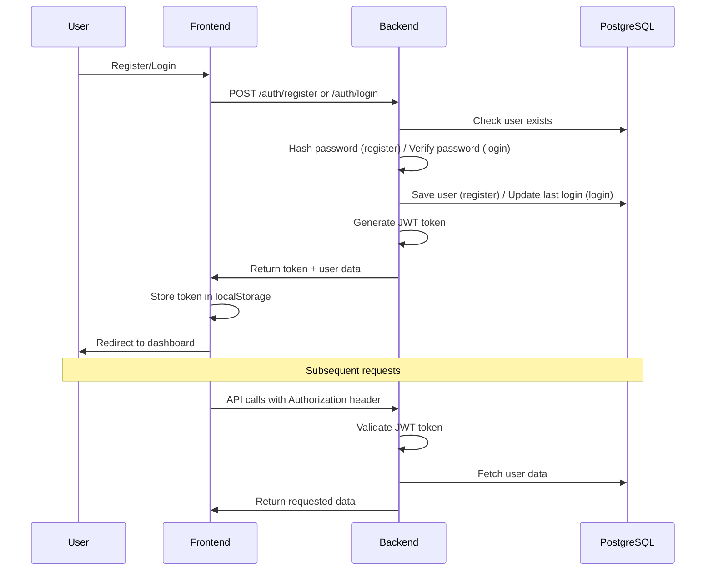

# 🔐 Complete User Authentication System with PostgreSQL

This project implements a **complete, production-ready user authentication system** using PostgreSQL as the persistent database. The system supports user registration, login with username/email, password hashing, JWT authentication, and session management.

## 🏗️ Architecture

```
┌─────────────────┐    ┌─────────────────┐    ┌─────────────────┐
│   React Client  │◄──►│  Spring Boot    │◄──►│   PostgreSQL    │
│   (Frontend)    │    │   (Backend)     │    │   (Database)    │
└─────────────────┘    └─────────────────┘    └─────────────────┘
    Port: 5174              Port: 8081              Port: 5432
```

## ✨ Features

### 🔐 **Complete Authentication System**
- ✅ **User Registration** with username, email, and password
- ✅ **User Login** with username OR email support
- ✅ **Password Hashing** using BCrypt
- ✅ **JWT Authentication** with secure token management
- ✅ **Session Management** with persistent login
- ✅ **Input Validation** and duplicate prevention
- ✅ **Error Handling** with proper error messages
- ✅ **Logout Functionality** with session cleanup

### 💾 **Persistent Database**
- ✅ **PostgreSQL Integration** for data persistence
- ✅ **Database Tables** for users, accounts, and transactions
- ✅ **One-time Signup, Reusable Login** - credentials work every time
- ✅ **Automatic Account Creation** for banking features
- ✅ **Data Validation** with unique constraints

### 🛡️ **Security Features**
- ✅ **Password Encryption** with BCrypt
- ✅ **JWT Token Security** with expiration
- ✅ **CORS Protection** with proper origins
- ✅ **SQL Injection Prevention** with JPA
- ✅ **Input Sanitization** and validation

## 🚀 Quick Start

### Option 1: Automatic Setup (Recommended)

1. **Install PostgreSQL** (if not already installed):
   - Download from: https://www.postgresql.org/download/
   - Remember the `postgres` superuser password during installation

2. **Run the PostgreSQL setup script**:
   ```powershell
   ./setup-postgresql.ps1
   ```

3. **Start the complete application**:
   ```powershell
   ./start-with-postgresql.ps1
   ```

4. **Access the application**:
   - Frontend: http://localhost:5174
   - Backend: http://localhost:8081

### Option 2: Manual Setup

1. **Install PostgreSQL**
2. **Create database and user**:
   ```sql
   CREATE DATABASE sulabh_db;
   CREATE USER sulabh_user WITH PASSWORD 'sulabh_password';
   GRANT ALL PRIVILEGES ON DATABASE sulabh_db TO sulabh_user;
   ```
3. **Start backend**: `./mvnw spring-boot:run`
4. **Start frontend**: `npm run dev`

## 👤 Default Users

The system automatically creates these test users:

| Role | Email | Username | Password |
|------|-------|----------|----------|
| Admin | admin@sulabh.com | admin | admin123 |
| Demo User | user@sulabh.com | demo_user | user123 |

## 🔧 Authentication System Details

### 1. User Registration

**Endpoint**: `POST /auth/register`

**Request**:
```json
{
  "username": "john_doe",
  "email": "john@example.com",
  "fullName": "John Doe",
  "password": "securepassword123",
  "phoneNumber": "+1234567890"
}
```

**Features**:
- ✅ Validates email format
- ✅ Checks username availability (3-30 chars, alphanumeric + underscore)
- ✅ Prevents duplicate email/username registration
- ✅ Hashes password with BCrypt
- ✅ Automatically creates bank account
- ✅ Returns JWT token for immediate login

### 2. User Login

**Endpoint**: `POST /auth/login`

**Request**:
```json
{
  "identifier": "john_doe", // Can be username OR email
  "password": "securepassword123"
}
```

**Features**:
- ✅ Login with username OR email
- ✅ Password verification with BCrypt
- ✅ JWT token generation
- ✅ Session persistence
- ✅ Account status checking
- ✅ Last login tracking

### 3. Session Management

**Features**:
- ✅ JWT tokens stored in localStorage
- ✅ Automatic token refresh
- ✅ Session validation on page reload
- ✅ Secure logout with token cleanup
- ✅ Protected routes with authentication guards

### 4. Password Security

**Implementation**:
- ✅ BCrypt hashing with salt rounds
- ✅ Password strength validation (minimum 6 characters)
- ✅ Secure password comparison
- ✅ No plain text passwords stored

## 🗄️ Database Schema

### Users Table
```sql
CREATE TABLE users (
    id BIGSERIAL PRIMARY KEY,
    email VARCHAR(100) UNIQUE NOT NULL,
    username VARCHAR(50) UNIQUE NOT NULL,
    full_name VARCHAR(100) NOT NULL,
    phone_number VARCHAR(20),
    password VARCHAR(255) NOT NULL,
    is_enabled BOOLEAN DEFAULT TRUE,
    created_at TIMESTAMP DEFAULT CURRENT_TIMESTAMP,
    updated_at TIMESTAMP DEFAULT CURRENT_TIMESTAMP
);
```

### Accounts Table
```sql
CREATE TABLE accounts (
    id BIGSERIAL PRIMARY KEY,
    user_id BIGINT NOT NULL REFERENCES users(id),
    account_number VARCHAR(255) UNIQUE NOT NULL,
    account_type VARCHAR(50),
    balance DECIMAL(19,2) DEFAULT 0.00,
    created_at TIMESTAMP DEFAULT CURRENT_TIMESTAMP,
    updated_at TIMESTAMP DEFAULT CURRENT_TIMESTAMP
);
```

### Transactions Table
```sql
CREATE TABLE transactions (
    transaction_id VARCHAR(255) PRIMARY KEY,
    user_id BIGINT REFERENCES users(id),
    amount DECIMAL(38,2),
    payment_method VARCHAR(50),
    status VARCHAR(50),
    created_at TIMESTAMP DEFAULT CURRENT_TIMESTAMP
);
```

## 🔄 Authentication Flow



## 🛠️ API Endpoints

### Authentication
- `POST /auth/register` - User registration
- `POST /auth/login` - User login
- `POST /auth/logout` - User logout
- `GET /auth/me` - Get current user info

### Protected Routes
All other API endpoints require valid JWT token in Authorization header:
```
Authorization: Bearer <jwt_token>
```

## 🧪 Testing the System

### 1. Test Registration
```bash
curl -X POST http://localhost:8081/auth/register \
  -H "Content-Type: application/json" \
  -d '{
    "username": "testuser",
    "email": "test@example.com",
    "fullName": "Test User",
    "password": "password123"
  }'
```

### 2. Test Login
```bash
curl -X POST http://localhost:8081/auth/login \
  -H "Content-Type: application/json" \
  -d '{
    "identifier": "testuser",
    "password": "password123"
  }'
```

### 3. Test Protected Route
```bash
curl -X GET http://localhost:8081/auth/me \
  -H "Authorization: Bearer <your_jwt_token>"
```

## 🔧 Configuration

### Database Configuration (`application.properties`)
```properties
# PostgreSQL Database
spring.datasource.url=jdbc:postgresql://localhost:5432/sulabh_db
spring.datasource.username=sulabh_user
spring.datasource.password=sulabh_password

# JPA Configuration
spring.jpa.hibernate.ddl-auto=update
spring.jpa.show-sql=true
spring.jpa.properties.hibernate.dialect=org.hibernate.dialect.PostgreSQLDialect

# JWT Configuration
jwt.secret=your-secret-key
jwt.expiration=86400000

# CORS Configuration
cors.allowed-origins=http://localhost:5173,http://localhost:5174
```

## 🐛 Troubleshooting

### Common Issues

1. **PostgreSQL Connection Error**
   ```
   org.postgresql.util.PSQLException: Connection refused
   ```
   **Solution**: Ensure PostgreSQL service is running

2. **Database Does Not Exist**
   ```
   PSQLException: database "sulabh_db" does not exist
   ```
   **Solution**: Run the setup script or create database manually

3. **Authentication Failed**
   ```
   FATAL: password authentication failed for user "sulabh_user"
   ```
   **Solution**: Check database credentials in `application.properties`

4. **Port Already in Use**
   ```
   Port 8081 was already in use
   ```
   **Solution**: Stop existing processes or change port

### Database Connection Test
```bash
psql -U sulabh_user -d sulabh_db -h localhost
```

## 📋 Requirements Met

✅ **PostgreSQL Integration**: Complete setup with persistent database  
✅ **User Tables**: Users table with username, email, hashed password  
✅ **User Signup**: Secure registration with duplicate prevention  
✅ **User Login**: Authentication with username OR email  
✅ **Persistent Login**: Same credentials work every time  
✅ **Session Management**: JWT-based authentication  
✅ **Logout Functionality**: Complete session cleanup  
✅ **Error Handling**: Proper error messages for invalid credentials  
✅ **Clean Code**: Modular architecture with separate services  
✅ **Password Security**: BCrypt hashing implementation  

## 🚀 Production Deployment

For production deployment:

1. **Environment Variables**:
   ```bash
   export DB_URL=jdbc:postgresql://your-db-host:5432/sulabh_db
   export DB_USERNAME=your_username
   export DB_PASSWORD=your_password
   export JWT_SECRET=your-production-secret
   ```

2. **SSL Configuration**:
   ```properties
   spring.datasource.url=jdbc:postgresql://host:5432/db?sslmode=require
   ```

3. **CORS Configuration**:
   ```properties
   cors.allowed-origins=https://your-domain.com
   ```

## 📚 Technology Stack

- **Backend**: Spring Boot 3.5.6, Spring Security, Spring Data JPA
- **Database**: PostgreSQL with Hibernate ORM
- **Authentication**: JWT (JSON Web Tokens)
- **Password Hashing**: BCrypt
- **Frontend**: React 18, TypeScript, Vite
- **HTTP Client**: Axios
- **Build Tool**: Maven
- **Java Version**: 21

---

## 🎯 **Result**: Complete Authentication System

This implementation provides a **production-ready authentication system** with:
- ✅ Persistent PostgreSQL database storage
- ✅ Secure user registration and login
- ✅ One-time signup, reusable login functionality
- ✅ Complete session management
- ✅ Professional-grade security features

**Users can now signup once and their credentials will work every time they visit the application!**